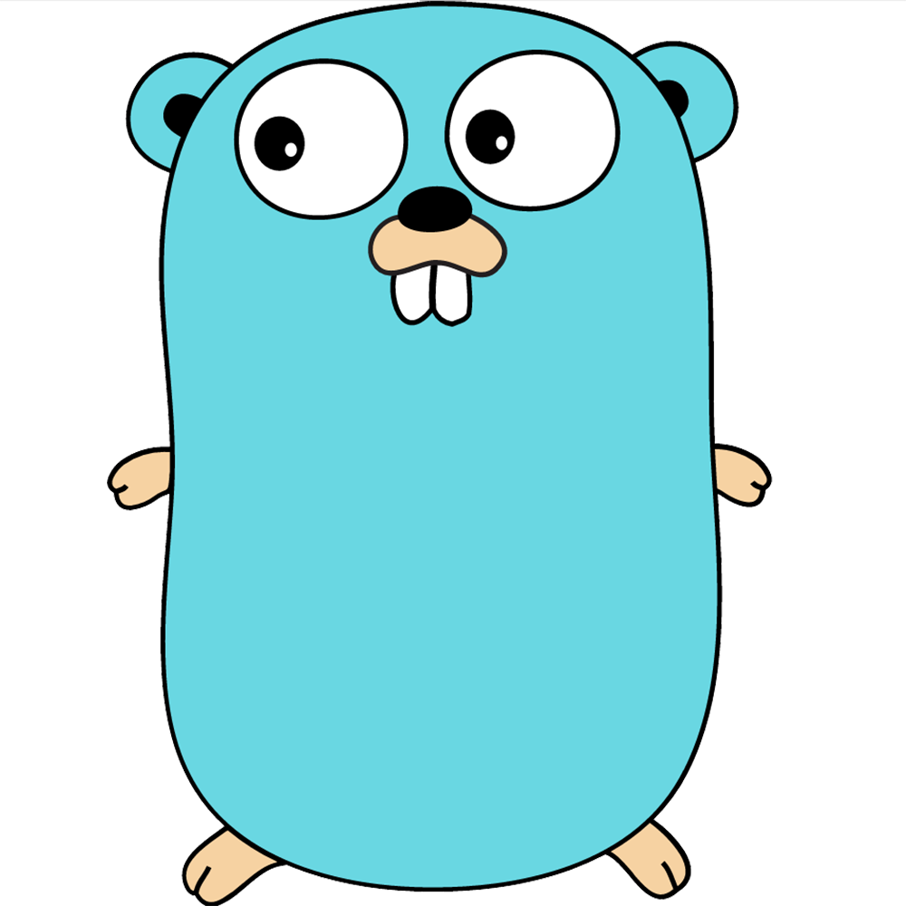

# Choose your language

## Official SDKs

The vikebot team maintains a handful **official** SDKs. You can see a list of all of them including links to their repositories below.

Language | Logo | Version | Maintainer | Repository
-------- | ---- | ------- | ---------- | ----------
GO |  | _Development_ | [@harwoeck](https://github.com/harwoeck) | <https://github.com/harwoeck/vikebot-go>
C# |  | _Unreleased_ | [@harwoeck](https://github.com/harwoeck) | <https://github.com/harwoeck/vikebot-csharp>

## Community maintained SDKs

<aside class="notice">
  <strong>You have developed a SDK?</strong> We'ld love to link it and add documention for it to this site. Just write us at <a href="mailto:hi@vikebot.com">hi@vikebot.com</a>
</aside>


# Install

You have choosen a SDK and now want to install it. Perfect! Just read below.

Because of extrem differences in the SDK installation process please visit the repository of your language to get specific instructions. After a successful installation come back to this site.

# Start playing

## Register for a game

## Connect to the server

```go
import "github.com/harwoeck/vikebot-go"

func main() {
    game, _ := vikebot.MustJoin("YOUR-AUTHTOKEN")
}
```

```csharp
using vikebot;

namespace MyBot
{
    class MyBot
    {
        public static void Main(string[] args)
        {
            using(Game game = new Game("YOUR-AUTHTOKEN"))
            {

            }
        }
    }
}
```

Before your bot can execute any commands you need to connect to the server. This is mostly done be the SDKs. The only thing left for you is to copy your `authtoken` from your [dashboard](https://app.vikebot.com) into your code.

# Instruct your BOT

## Move

```go
err := game.Player.Move(vikebot.DirectionNorth)
if err != nil {
    // Something "bad" happend. Maybe you violated the move restrictions?
}
// Your bot successfully moved into into cardinal-direction NORTH
```

```csharp
try
{
    game.Move(Direction.North);
    // Your bot successfully moved into into cardinal-direction NORTH
}
catch (InvalidGameActionException exc)
{
    // Something "bad" happend. Maybe you violated the move restrictions?
}
```

## Attack

```go
err := game.Player.Attack(vikebot.DirectionNorth)
if err != nil {
    // Something "bad" happend. Maybe you
    //   - violated the attack restrictions?
    //   - attacked an empty field? (Hint: Check with the `Watch` instruction)
}
// Your bot hitted someone standing the field specified by your direction
```

```csharp
try
{
    game.Player.Attack(Direction.North);
    // Your bot hitted someone standing the field specified by your direction
}
catch (InvalidGameActionException exc)
{
    // Something "bad" happend. Maybe you
    //   - violated the attack restrictions?
    //   - attacked an empty field? (Hint: Check with the `Watch` instruction)
}
```

## Radar

```go
var counter int
var err error
counter, err = game.Player.Radar()
if err != nil {
    // Something "bad" happend. Maybe you violated the radar restrictions?
}
// Yeah! We safed the amount of people in your area into the `counter` variable.
```

```csharp
try
{
    int counter = game.Player.Radar();
    // Yeah! We safed the amount of people in your area into the `counter` variable.
}
catch (InvalidGameActionException exc)
{
    // Something "bad" happend. Maybe you violated the radar restrictions?
}
```

## Watch

```go
var myArea vikebot.MapEntity
myArea, err = game.Player.Watch()
if err != nil {
    // Something "bad" happend. Maybe you violated the watch restrictions?
}
// Safed the players around you
```

```csharp
try
{
    MapEntity myArea = game.Player.Watch();
    // Safed the players around you
}
catch (InvalidGameActionException exc)
{
    // Something "bad" happend. Maybe you violated the watch restrictions?
}
```

## Environment

```go
var myArea vikebot.EnvironmentEntity
myArea, err = game.Player.Environment()
if err != nil {
    //
}
//
```

```csharp

```

## Scout

```go


```

```csharp

```

## Defend and Undefend

```go


```

```csharp

```

# Examples

## The cowardly bot

```go
game := vikebot.MustJoin("YOUR-AUTHTOKEN")
p := game.Player
for true {
    radar := p.Radar()
    if radar > 0 {
        area := p.Watch()

        potentiallyWest := helperCountPotentiallyWest(area)
        potentiallyEast := helperCountPotentiallyEast(area)

        if potentiallyWest > potentiallyEast {
            p.Move(vikebot.DirectionEast)
        } else {
            p.Move(vikebot.DirectionWest)
        }
    }
}
```

```csharp
using (Game game = new Game("YOUR-AUTHTOKEN"))
{
    Player p = game.Player;
    while (true)
    {
        int radar = p.Radar();
        if (radar > 0)
        {
            MapEntity area = p.Watch();

            int potentiallyWest = HelperCountPotentiallyWest(area);
            int potentiallyEast = HelperCountPotentiallyEast(area);

            if (potentiallyWest > potentiallyEast)
            {
                p.Move(Direction.East);
            }
            else
            {
                p.Move(Direction.West);
            }
        }
    }
}
```

This bot doesn't have any "real" logic inside. The only thing he does is check whether potentially more players are on the east or west side of him and runs into the opposite direction. Just image the `Helper`-functions would return the amount of players.

In a real game you of course need to check

- All cardinal-directions
- Do something "intelligent" to ether kill an opponent or flee.

Also you probaply want to consider some other parameters into your logic like ...

- Health of your player
- Amount of enemies in your area (`Radar`)
