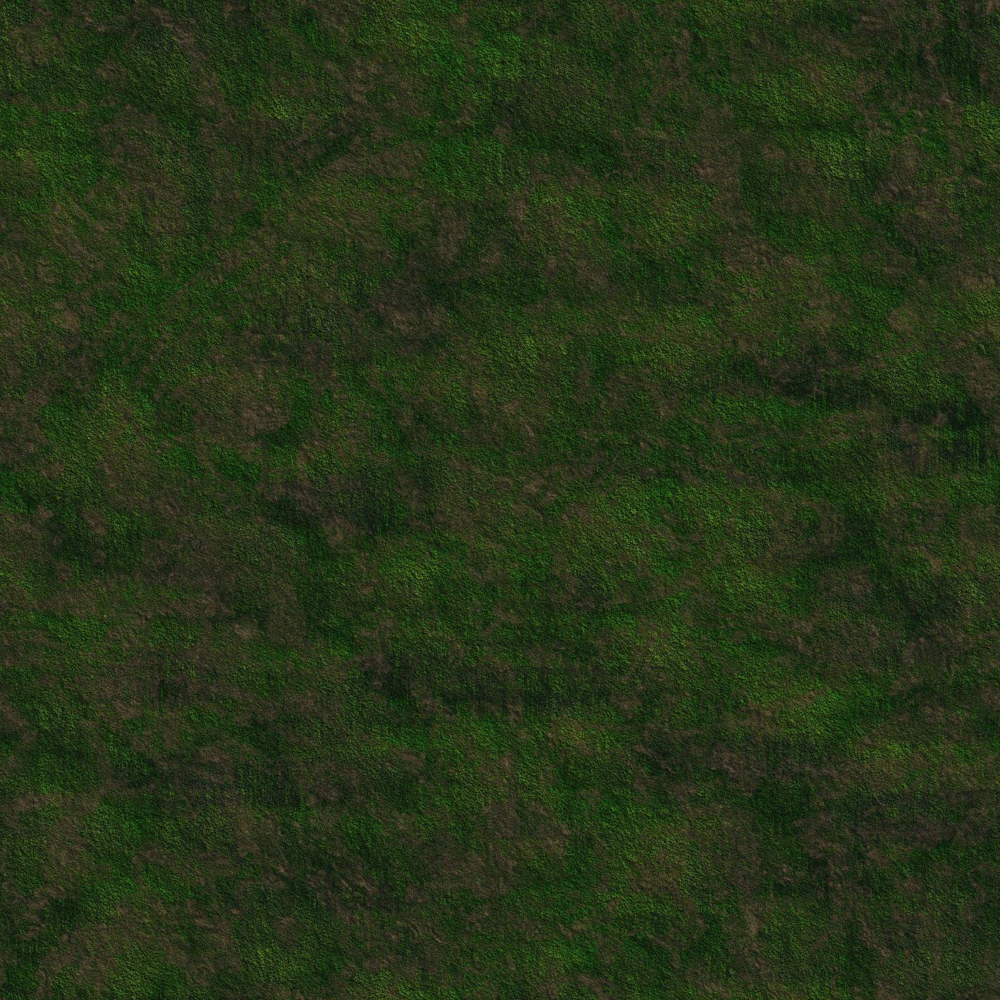

# Official vikebot sdk - wiki
# Choose your language

## Official SDKs

The vikebot team maintains a handful official SDKs. You can see a list of all of them including links to their repositories below.

Language | Logo | Version | Maintainer | Repository
-------- | ---- | ------- | ---------- | ----------
GO |  | _Development_ | [@harwoeck](https://github.com/harwoeck) | [github.com/harwoeck/vikebot-go](https://github.com/harwoeck/vikebot-go)
C# |  | _Unreleased_ | [@harwoeck](https://github.com/harwoeck) | [github.com/harwoeck/vikebot-csharp](https://github.com/harwoeck/vikebot-csharp)

## Community maintained SDKs

We heavily rely on our community to contribute to this project. If you would like to help you can implement SDKs in new languages. We'ld then love to link it and add documentation here. We think a single place where we collect all the infromation needed suits well, espacially for beginners. If you have any questions you call always contact us on any support channel.

Language | Logo | Version | Maintainer | Repository
-------- | ---- | ------- | ---------- | ----------
Java |  | _Unreleased_ | [@phillip-r99](https://github.com/phillip-r99) | [github.com/vikebot/vikebot-java](https://github.com/vikebot/vikebot-java)

# Install

You have choosen a SDK and now want to install it. Perfect! Just read below.

Because of extrem differences in the SDK installation process please visit the repository of your sdk to get specific instructions. In general installation guidelines should be one of the first things in the project's README. After a successful installation come back to this site.

# Start playing

## Register for a game

You can register for a game on your <a href="app.vikebot.com/dashboard">vikebot dashboard</a>, then you will receive an `AUTH-THOKEN`.

## Connect to the server

```go
import "github.com/harwoeck/vikebot-go"

func main() {
    game := vikebot.MustJoin("YOUR-AUTHTOKEN")
}
```

```csharp
using vikebot;

namespace MyBot
{
    class MyBot
    {
        public static void Main(string[] args)
        {
            using(Game game = new Game("YOUR-AUTHTOKEN"))
            {

            }
        }
    }
}
```

Before your bot can execute any commands you need to connect to the server. This is mostly done by the SDKs. The only thing left for you is to copy your `authtoken` from your [dashboard](https://app.vikebot.com) into your code.

## See the results

If you want to see a graphical representation of the game's current state (e.g. your player moving while you execute your bot code) open <https://watch.vikebot.com/YOUR-WATCHTOKEN> in your browser where the `watchtoken` can again be copied from your dashboard.

The mentioned website uses our open websocket protocol to receive special preprossed data that can be easily rendered. All people who want to do their own graphical rendering can also use this protocol and informations provided in the reference implementation.

# About your Bot


## Health

Each player start's with a default of `100` health-points (`HP`). Every time someone hits you the damage will be subtracted of your current `HP`. The moment you reach a value below `1 HP` you die and your deaths counter will be increased once. After death you will respawn.

## Location

At the start of the game each character will get randomly placed in the map. The map itself has a fixed per game size that doesn't change. There is no way to tell the absolute position of your player. You can't run out of this borders.

To check whether you are close to the edge inspect the `MapEntity` returned from `Environment` action for `BlockType.EndOfMap`s.

## Respawn after death

If you die, the gameserver will respawn you with the default health points randomly on another position on the map.

## Orientation

A player is able to watch in `4` directions: `directionNorth` , `directionEast` , `directionSouth` and `directionWest`where north is at the top of the map.

## Ratelimitation

These ratelimits are describing how often an command can be called `per second` from a client. Therefore a `1` means the client is able to call this operation each second `once`. A `2` means the client can use the operation `twice` a second.

| Operation | Ratelimit |
| --------- | --------- |
| Move   | 1|
|Rotate | 2|
|Radar | 1|
|Scout | 2|
|Environment | 5
|Watch | 5|
|Attack | 10|
|Defend and Undefend | 5|

# Instruct your Bot

## Rotate

```go
game.Player.Rotate(vikebot.AngleRight)
// Your bot successfully rotated into the right direction (dirEast if default value is dirNorth)
```

 If the function is called with the string parameter `vikebot.angleRight` the player is rotating to the right and with `vikebot.angleLeft` the player is rotating to the left. Default watching direction of the player is `vikebot.DirectionNorth`

 On the image below, the bot is watching in `vikebot.DirectionEast`

 

## Move

```go
err := game.Player.Move(vikebot.DirectionNorth)
if err != nil {
    // Something "bad" happend. Maybe you violated the move restrictions?
}
// Your bot successfully moved into into cardinal-direction NORTH
```

This command can be used to move the player in the given `vikebot.Direction`. The player will always be `moved by 1` in the map area if it is possible. So moving in `vikebot.DirectionEast` while watching in `vikebot.DirectionNorth` is possible.

## Attack

```go
enemyHealth, err := game.Player.Attack()
if err != nil {
    // Something "bad" happend. Maybe you
    //   - violated the attack restrictions?
    //   - attacked an empty field? (Hint: Check with the `Watch` instruction)
}
// Your bot hitted someone standing the field specified by your direction
```

```csharp
try
{
    game.Player.Attack(Direction.North);
    // Your bot hitted someone standing the field specified by your direction
}
catch (InvalidGameActionException exc)
{
    // Something "bad" happend. Maybe you
    //   - violated the attack restrictions?
    //   - attacked an empty field? (Hint: Check with the `Watch` instruction)
}
```

This command can be used to attack an enemy in front of the player. The `Enemyhealth` is returned as `int`. If the player kills the enemy, the counter for `Kills` will be increased and the enemy's counter for `Deaths` will also be increased.

## Radar

```go
var counter int
var err error
counter, err = game.Player.Radar()
if err != nil {
    // Something "bad" happend. Maybe you violated the radar restrictions?
}
// Yeah! We safed the amount of people in your area into the `counter` variable.
```

```csharp
try
{
    int counter = game.Player.Radar();
    // Yeah! We safed the amount of people in your area into the `counter` variable.
}
catch (InvalidGameActionException exc)
{
    // Something "bad" happend. Maybe you violated the radar restrictions?
}
```

This command can be used to determine the amount of people within the player's action area. The value is returned as `int`. The zone is a `11x11` matrix with the player in its center.

The example below would return `4`.


## Watch

```go
var healthMap [][]int
healthMap, err = game.Player.Watch()
if err != nil {
    // Something "bad" happend. Maybe you violated the watch restrictions?
}
// Handle the health information
```

```csharp

```

This command can be used to determine the `PlayerHealth` within the player's watching area. The value is returned as a `int`. The zone is a `5x11` matrix in case of the player is watching in `vikebot.DirectionNorth`.

For Example if the direction where the player is watching is `vikebot.DirectionEast` the matrix is of the size `11x5` where `11` is the height `y`.


## Environment

```go
var area vikebot.EnvironmentEntity
area, _ = game.Player.Environment()
```

```csharp
EnvironmentEntity ee = game.Player.Environment();
```

This command can be used to determine the `vikebot.BlockType` within the player's action area. The value is returned as a `string`. The zone is a `11x11` matrix with the player in its center.


## Scout

```go
counter, err := game.Player.Scout(5)
if err != nil {
    // Something "bad" happend.
}
```

```csharp
int count = game.Player.Scout(5);
```

`Scout` counts up the amount of people in the direction you are currently watching. You can specify how far the player "watches" with the argument to the function call.


## Defend and Undefend

```go
err := game.Player.Defend()
if err != nil {
    // The player is already in defense mode
}
err = game.Player.Undefend()
if err != nil {
    // The player is already not defending
}
```

```csharp

```
`Defend` puts the player in a defense mode, that way the player gets only half of the damage. While the player is defending he/she isn't able to move. When the fight is over or the player wants to move away he/she can get out of the defense mode with `undefend`. 


# Types

## Direction

```go
north := vikebot.DirectionNorth
east := vikebot.DirectionEast
south := vikebot.DirectionSouth
west := vikebot.DirectionWest
```

```csharp
Direction north = Direction.North;
Direction east = Direction.East;
Direction south = Direction.South;
Direction west = Direction.West;
```

Direction specifies one of the four cardinal-directions. Used in some different actions like `Move` or `Attack`.

Value | Description
----- | -----------
`North` | Specifies the cardinal-direction "north"
`East` | Specifies the cardinal-direction "east"
`South` | Specifies the cardinal-direction "south"
`West` | Specifies the cardinal-direction "west"

## BlockType

> Usage: You can use this to equality-check a block's `Type` value.

```go
swamp := vikebot.BlockSwamp
stonetile := vikebot.BlockStonetile
dirt := vikebot.BlockDirt
grass := vikebot.BlockGrass
lava := vikebot.BlockLava
lavarock := vikebot.BlockLavarock
water := vikebot.BlockWater
endofmap := vikebot.BlockEndOfMap
fog := vikebot.BlockFog
```

```csharp
BlockType swamp = BlockType.Swamp;
BlockType stonetile = BlockType.Stonetile;
BlockType dirt = BlockType.Dirt;
BlockType grass = BlockType.Grass;
BlockType lava = BlockType.Lava;
BlockType lavarock = BlockType.Lavarock;
BlockType water = BlockType.Water;
BlockType endofmap = BlockType.EndOfMap;
BlockType fog = BlockType.Fog;
```

```java
BlockType swamp = BlockType.SWAMP;
BlockType stonetile = BlockType.STONETILE;
BlockType dirt = BlockType.DIRT;
BlockType grass = BlockType.GRASS;
BlockType lava = BlockType.LAVA;
BlockType lavarock = BlockType.LAVAROCK;
BlockType water = BlockType.WATER;
BlockType endofmap = BlockType.ENDOFMAP;
BlockType fog = BlockType.FOG;
```

Identification | Image | Description
-------------- | ----- | -----------
`Swamp` |  |
`Stonetile` |  |
`Dirt` |  |
`Grass` |  |
`Lava` |  |
`Lavarock` |  |
`Water` |  | Water can sometimes occour in form of a little lake. Don't run into this fields or you will encounter a damage at `-20hp` per second.
`EndOfMap` |  |
`Fog` |  |

# Examples

## The cowardly bot

```go
game := vikebot.MustJoin("YOUR-AUTHTOKEN")
p := game.Player
for true {
    radar := p.Radar()
    if radar > 0 {
        area := p.Watch()

        potentiallyWest := helperCountPotentiallyWest(area)
        potentiallyEast := helperCountPotentiallyEast(area)

        if potentiallyWest > potentiallyEast {
            p.Move(vikebot.DirectionEast)
        } else {
            p.Move(vikebot.DirectionWest)
        }
    }
}
```

```csharp
using (Game game = new Game("YOUR-AUTHTOKEN"))
{
    Player p = game.Player;
    while (true)
    {
        int radar = p.Radar();
        if (radar > 0)
        {
            MapEntity area = p.Watch();

            int potentiallyWest = HelperCountPotentiallyWest(area);
            int potentiallyEast = HelperCountPotentiallyEast(area);

            if (potentiallyWest > potentiallyEast)
            {
                p.Move(Direction.East);
            }
            else
            {
                p.Move(Direction.West);
            }
        }
    }
}
```

This bot doesn't have any "real" logic inside. The only thing he does is check whether potentially more players are on the east or west side of him and runs into the opposite direction. Just image the `Helper`-functions would return the amount of players.

In a real game you of course need to check

- All cardinal-directions
- Do something "intelligent" to ether kill an opponent or flee.

Also you probaply want to consider some other parameters into your logic like ...

- Health of your player
- Amount of enemies in your area (`Radar`)

# Abbreviations

## User

User specifies the real human person.

## Player

A player is a instance representing a user inside a game round. A player may be able to controll multiple characters.

## Character

A character is a single controllable entity placed inside the map. Each one has it's own location, health, etc.
